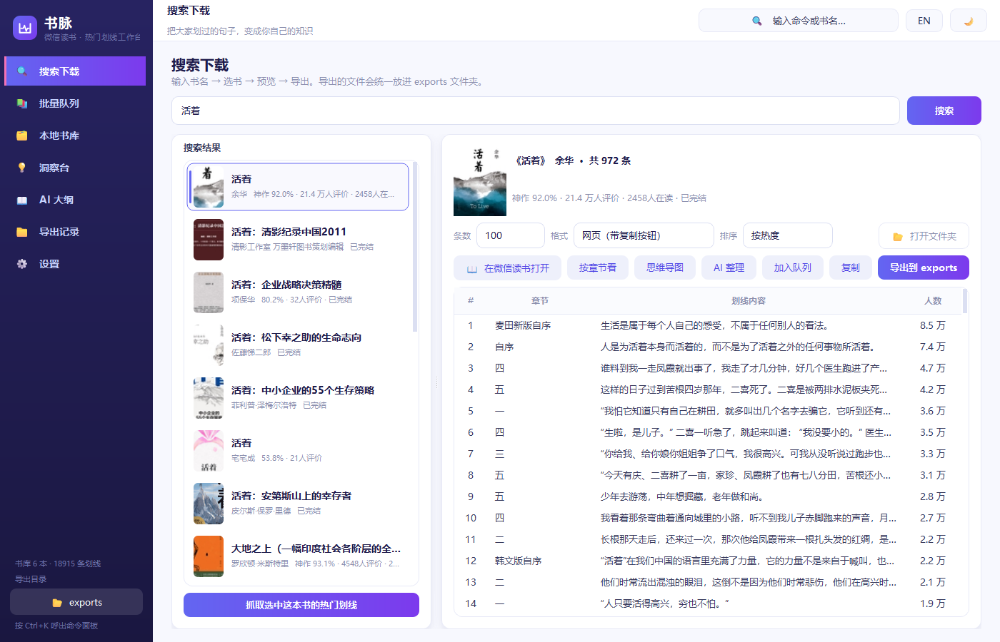
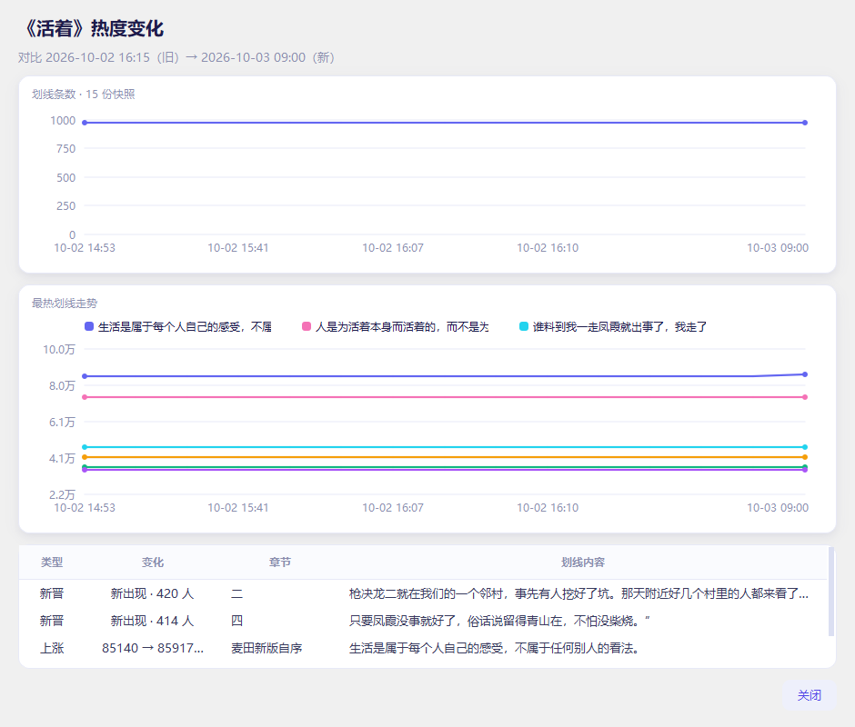
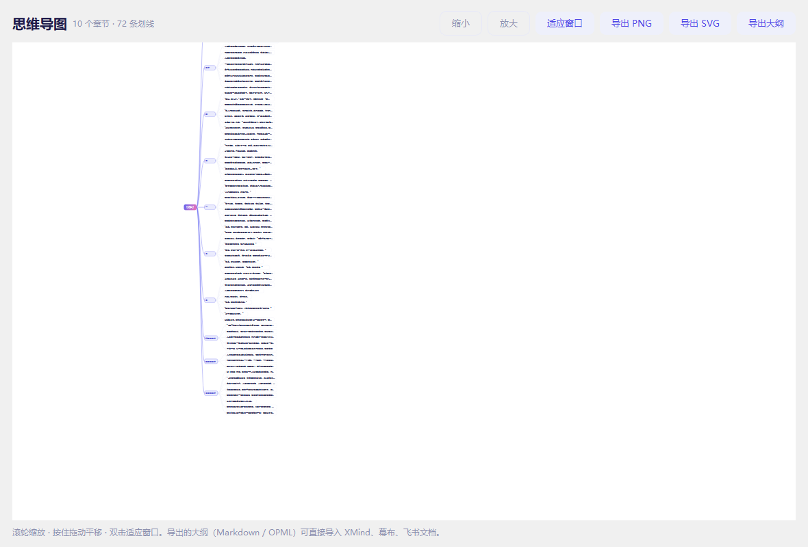
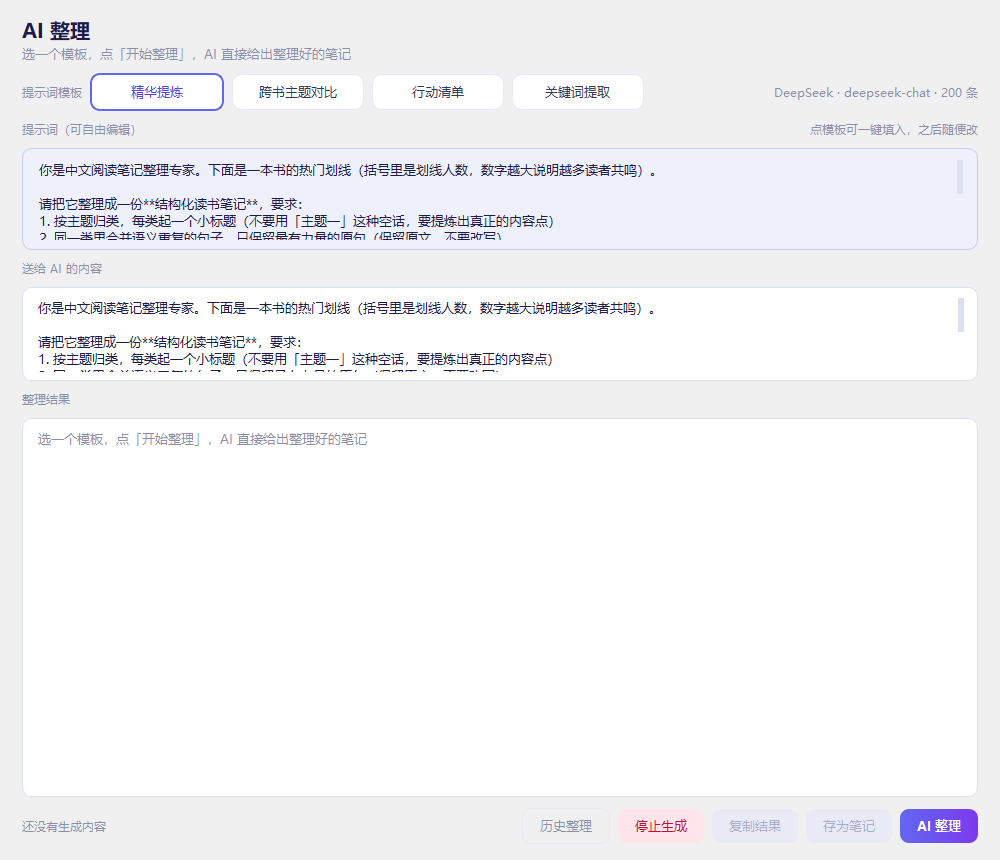
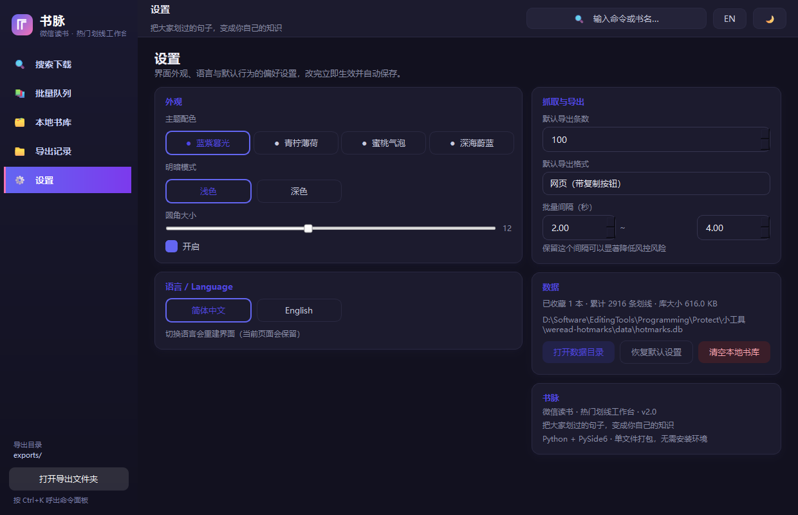
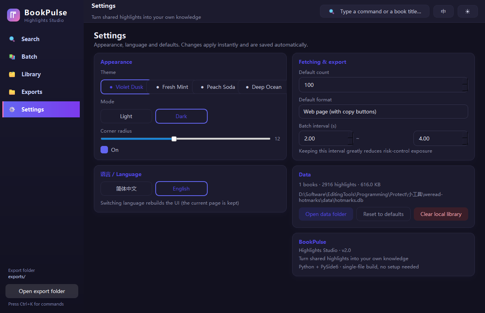
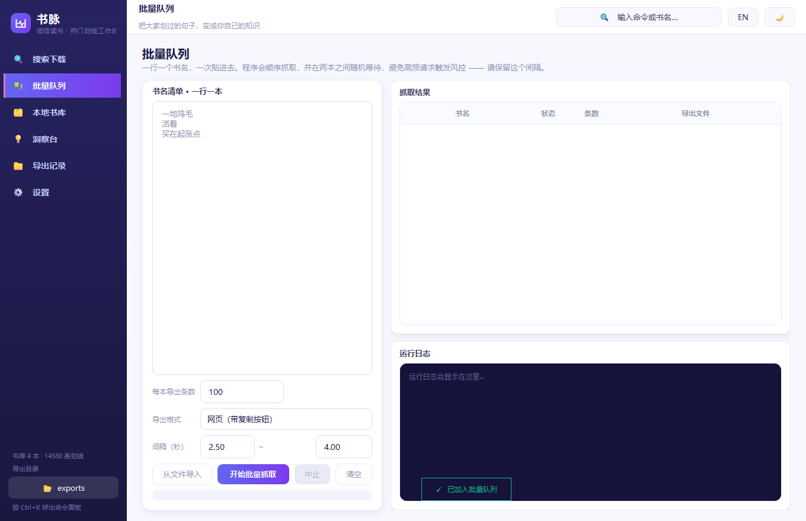
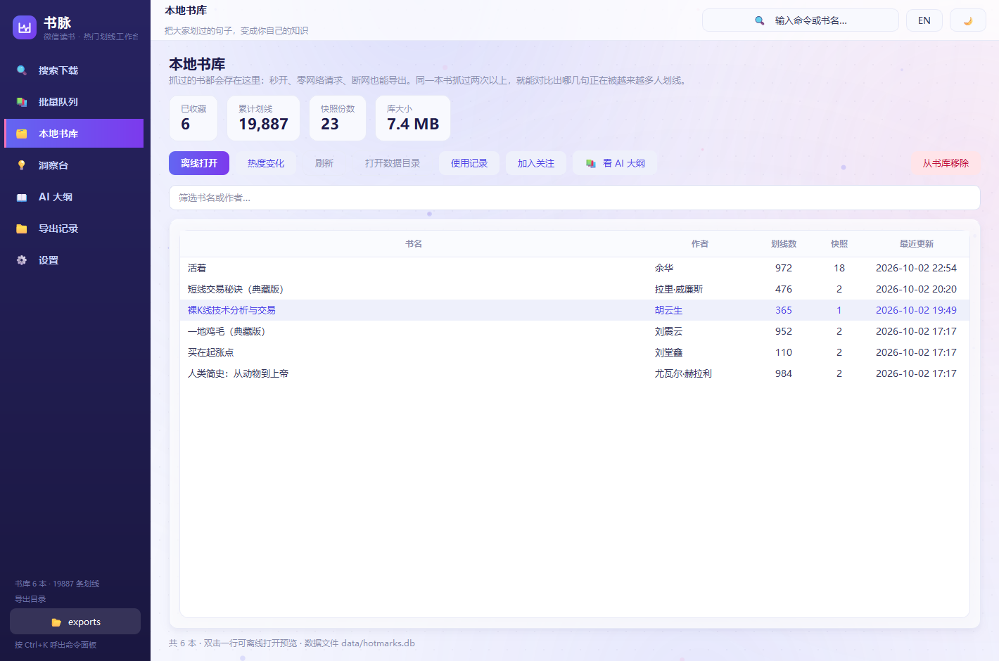
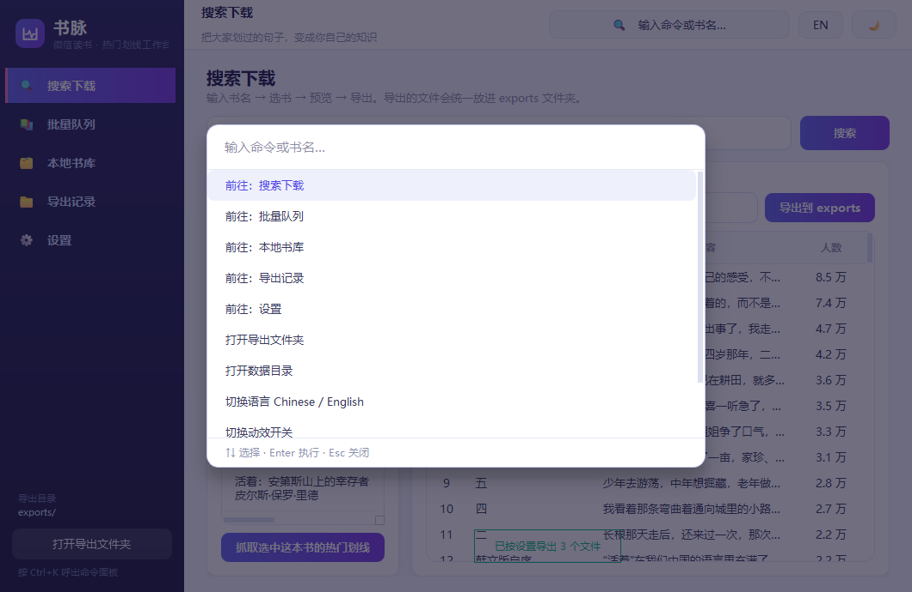
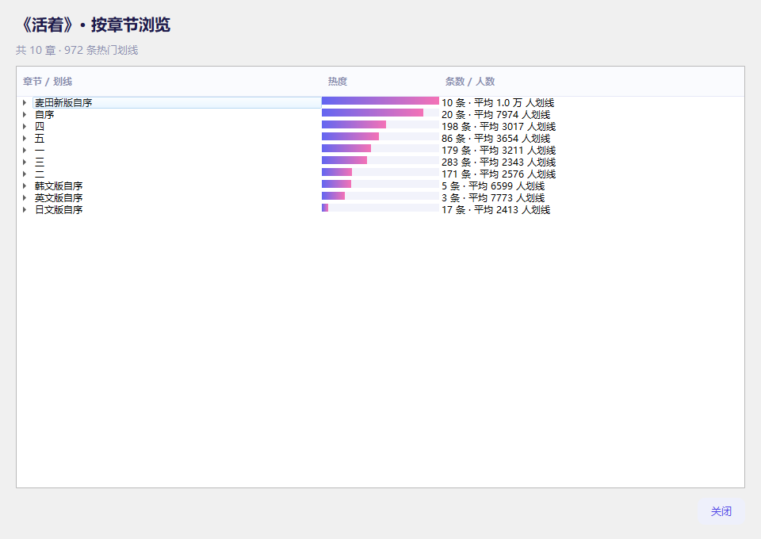

<div align="center">


# 书脉 BookPulse

**把微信读书里「大家划过的句子」，整理成你自己的知识库**

抓取 · 沉淀 · AI 整理 · 九种格式导出

[](https://www.python.org/)
[](https://pypi.org/project/PySide6/)
[](LICENSE)
[](#)
[](#%E5%85%8D%E8%B4%A3%E5%A3%B0%E6%98%8E)

[功能特性](#-功能特性) · [快速开始](#-快速开始) · [界面预览](#-界面预览) · [导出格式](#-导出格式) · [常见问题](#-常见问题) · [English](README.en.md)

</div>

---

## 📖 这是什么

微信读书里有大量读者划线，但网页版**没有聚合入口** —— 你只能一页页翻，看不到"哪句话被最多人划了"。

**书脉**把这些数据取出来、存到本地、变成你自己的素材：

- 🔍 搜一本书，**一眼看出哪本值得读**（推荐值 / 评价人数 / 在读人数）
- 📥 抓下全书热门划线，**按人数排序**，最戳人的句子排在前面
- 🗄️ 存进本地书库，**离线秒开**，还能追踪"哪句话正在被越来越多人划线"
- 🤖 一键交给 AI 整理成笔记（支持 DeepSeek / 智谱 / 硅基流动 / 阿里云 / 本地 Ollama）
- 📄 导出成 **Markdown / Word / PDF / EPUB / 网页 / 长图** 等九种格式
- 🧠 跨书检索、跨书去重合并、思维导图、热度趋势图

> 实测规模：《活着》972 条 ·《一地鸡毛》952 条 ·《人类简史》984 条 —— 全量一次取回，没有任何分页循环。

---

## ✨ 功能特性

### 抓取与选择
| 功能 | 说明 |
|---|---|
| **书籍指标** | 搜索结果直接展示 **推荐值 / 评价人数 / 评价等级（神作·好评…）/ 在读人数 / 出版社 / 完结状态**，同名书一眼分高下（《活着》92.0% vs 同名书 53.8%） |
| **一键抓全书** | 热门划线**一次全量取回**（实测近千条），不写分页循环 |
| **批量队列** | 一行一本，顺序抓取，进度实时可见、可随时中止；**随机间隔 2~4 秒**，默认开启防风控 |
| **书单导入** | 支持 txt / csv 导入，也能把文件**直接拖进窗口**，自动识别四种写法 |
| **书封封面** | 后台下载 + 本地缓存，列表缩略图 + 详情大图 |

### 本地书库（SQLite）
- **快照制存储**：每次抓取新增一份快照而非覆盖，跨快照按文本指纹对齐同一条划线
- **热度变化追踪**：两次抓取之后，就能看出"哪句话正在被越来越多人划线"、哪些是新晋的
- **全文检索**：FTS5 + trigram 分词，跨书搜「复利」「命运」**0.3ms** 返回（vs 传统 LIKE 5.2ms）
- **离线秒开**：零网络请求即可浏览全部已收藏书籍
- **使用记录**：搜索 / 抓取 / 导出 / 离线打开全程留痕，可回溯

### 加工与分析
| 功能 | 说明 |
|---|---|
| **一键 AI 整理** | 点一下，AI 把散句整理成结构化笔记。**提示词完全自定义** —— 不再受限于内置模板，划线正文会自动附上，忘了写占位符也不会丢内容 |
| **AI 大纲** | 每本书的**章节 AI 要点**，单独一页浏览 / 复制 / 导出（Markdown / 纯文本 / 网页）—— 详见「AI 大纲」一节 |
| **跨书主题聚合** | 勾选 2~5 本，产出「这些书在同一个问题上各自怎么说」 |
| **跨书去重合并** | 相似度聚类（字符 bigram + Jaccard），把不同书里说同一件事的句子归为一组，输出共识度排序 |
| **热度趋势图** | 自绘折线图 + 柱状图，看单句人数随时间的变化与全书热度分布 |
| **思维导图** | 自绘树形脑图，可导出 **PNG / SVG**，也能导出大纲（Markdown / OPML）**直接导入 XMind** |
| **关注推送** | 关注书单 + 定时增量检查，有新晋热门划线时推送到**飞书**（支持签名校验与卡片消息）|

### 导出（9 种格式）
Markdown · 纯文本 · **Word (.docx)** · **EPUB** · **PDF** · 网页 · 分享版网页 · CSV · JSON

**导出模板可自定义**：正文字号 / 行高 / 是否带章节 / 是否带序号 / 主题色 / 纸张 —— 一次设置，对 6 种文本格式统一生效。

> 默认**只导出内容**（不带"多少人划线"），因为面向的是"喂给 AI 整理"。需要时可一键开启。

### 界面
- 🌗 **8 种外观**：4 套主色（紫罗兰暮光 / 青柠薄荷 / 蜜桃气泡 / 深海蓝）+ 明暗，另支持**跟随系统**
- 🌏 **中英双语**：界面全部文案可切换（380+ 条）
- ⌨️ **命令面板**：`Ctrl+K` 唤起，低频操作全收在这里，按钮不必全堆侧栏
- 🎯 **专注模式**：`Ctrl+Shift+F` 一键隐藏侧栏与顶栏
- 🪟 **可选无边框窗口**：自绘标题栏，同时**保留原生缩放 / 贴边分屏 / 双击最大化**
- 📊 **结果排序**：按热度 / 按章节，**在表格原地切换**不用另开窗口；导出跟随当前排序
- 📖 **一键跳转微信读书**：结果区点一下，用系统浏览器打开官方书籍页（登录态由浏览器自己维持）
- ✨ 克制动效：切页淡入、卡片错落入场、数字平滑滚动、Toast 滑入 —— 且可**一键全关**

---

## 🚀 快速开始

### 方式一：直接下载（不需要任何技术背景）

到 **[Releases](../../releases/latest)** 页面下载 `书脉.exe`（约 45 MB），双击即可运行。

- 单文件，**不需要安装 Python**，也不需要安装任何环境
- 首次打开约 2 秒（程序需要自解压）
- 数据、导出文件都会生成在 **exe 同目录**的 `data/` 和 `exports/` 里，看得见、可备份
- 如果 Windows 提示"未知发布者"，点「更多信息」→「仍要运行」即可（个人开源项目没有代码签名证书）

### 方式二：从源码运行（想改代码，或不是 Windows）

```bash
# 1. 克隆
git clone https://github.com/DylanWu-1024/shumai-bookpulse.git
cd shumai-bookpulse

# 2. 创建虚拟环境并安装依赖（只有 PySide6 一个）
python -m venv .venv
.venv/Scripts/python.exe -m pip install -r requirements.txt    # Windows
# source .venv/bin/activate && pip install -r requirements.txt  # macOS / Linux

# 3. 启动图形界面
.venv/Scripts/python.exe src/app_gui.py
```

Windows 用户也可以直接双击 **`启动工作台.bat`**（首次使用前先双击一次 `setup_env.bat` 自动装好环境）。

### 方式三：只要命令行（零第三方依赖）

命令行版**只用 Python 标准库**，连 PySide6 都不需要：

```bash
python src/weread_hotmarks.py "活着" --top 100 --fmt md
```

```bash
# 更多用法
python src/weread_hotmarks.py "活着" --all                  # 全书热门划线
python src/weread_hotmarks.py "活着" --fmt html --open      # 导出网页并自动打开
python src/weread_hotmarks.py "活着,围城,一地鸡毛" --batch --fmt md   # 批量
python src/weread_hotmarks.py --help                        # 查看全部参数
```

输出示例（`--fmt md`）：

```markdown
# 《活着》· 热门划线

- 作者：余华
- 共 972 条

---

1. [麦田新版自序] 生活是属于每个人自己的感受，不属于任何别人的看法。
2. [自序] 人是为活着本身而活着，而不是为了活着之外的任何事物而活着。
3. ...
```

---

## 🖼️ 界面预览

**搜索与下载** —— 候选列表直接给出推荐值与在读人数，右侧是抓取结果



**洞察台** —— 跨书关键词检索 / 主题聚合 / 关注推送


**热度趋势** —— 看某句话的人数随时间怎么变



**思维导图** —— 按章节铺开，可导出 PNG / SVG / OPML



**一键 AI 整理** —— 支持 5 家大模型，流式输出



**设置** —— 8 种外观、导出模板、AI 与飞书配置


<details>
<summary>更多截图（深色模式 / 英文界面 / 批量队列 / 本地书库 / 命令面板 …）</summary>

| 深色模式 | 英文界面 |
|---|---|
|  |  |

| 批量队列 | 本地书库 |
|---|---|
|  |  |

| 命令面板 Ctrl+K | 按章节浏览 |
|---|---|
|  |  |

</details>

---

## 📤 导出格式

| 格式 | 适合什么场景 |
|---|---|
| **Markdown** | **喂给 AI 整理**（推荐），或导入 Obsidian / Notion |
| **纯文本** | 万能兜底，任何输入框都能粘 |
| **Word (.docx)** | 交作业、写读书报告、需要批注 |
| **EPUB** | 导入微信读书 / Kindle / Apple Books 当"读书笔记书" |
| **PDF** | 打印、存档、需要固定排版 |
| **网页 (HTML)** | 本地打开直接看，**内置一键复制按钮** |
| **分享版网页** | **发给朋友**：手机自适应、按章节分组，微信/飞书里有预览 |
| **CSV** | Excel 打开不乱码，可做透视表 |
| **JSON** | 给程序用，含完整字段 |

**导出模板**（设置页可调，对所有格式生效）：

| 选项 | 取值 |
|---|---|
| 正文字号 | 12 ~ 20 px |
| 行高 | 1.4 ~ 2.4 |
| 是否带章节名 | 开 / 关 |
| 是否带序号 | 开 / 关 |
| 标题主题色 | 任意十六进制色 |

---

## 🧱 项目结构

```
shumai-bookpulse/
├── 启动工作台.bat            ← 双击打开图形界面
├── 一键查热门划线.bat         ← 双击用命令行版
├── setup_env.bat             ← 一次性安装环境
├── build_exe.bat             ← 打包成 exe
├── 使用说明.html             ← 面向使用者的图文说明
│
├── src/                      ★ 全部源码
│   ├── app_gui.py               界面主程序（页面 / 对话框 / 交互）
│   ├── core.py                  抓取、重试、九种格式渲染与导出
│   ├── store.py                 SQLite 书库 + FTS5 全文索引
│   ├── exporters.py             Word / EPUB / 打印版生成（纯标准库）
│   ├── template.py              网页与分享版 HTML 模板
│   ├── theme.py                 配色体系与全局样式（8 种外观）
│   ├── widgets.py               自绘控件：图表 / 思维导图 / 动效 / 命令面板
│   ├── mindmap.py               思维导图数据与大纲导出
│   ├── merge.py                 跨书相似句聚类
│   ├── ai.py                    大模型调用（5 家提供商，流式）
│   ├── feishu.py                飞书卡片推送
│   ├── watch.py                 关注书单与增量检查
│   ├── i18n.py                  中英文案
│   ├── settings.py              偏好持久化
│   ├── make_icon.py             纯代码生成应用图标
│   ├── build_exe.py             打包脚本
│   └── weread_hotmarks.py       命令行版入口
│
├── 浏览器版/weread-hotmarks.js  ← 最早的书签脚本版（浏览器控制台直接跑）
├── docs/                       设计文档与 Logo
├── 预览截图/                    各页面截图
├── 成果样例/                    几本书的导出样例，可直接打开看效果
│
├── data/                     ★ 你的数据（自动生成，已在 .gitignore）
└── exports/                  导出结果默认落这里
```

---

## 🛠️ 技术选型

**整个项目只有一个第三方依赖：PySide6。**

这不是偷懒，是刻意的选择 —— 这个项目要打包成一个能发给别人的单文件程序，每多一个依赖，体积和出错概率都会涨。

| 需求 | 常见做法 | 本项目的做法 |
|---|---|---|
| Word 生成 | python-docx（拖入 lxml，+8MB） | 自己拼 **OOXML**（zip + XML） |
| EPUB 生成 | ebooklib（又一层依赖） | 自己拼 **EPUB 3.0**（zip + XHTML + OPF） |
| PDF 生成 | reportlab（C 扩展）/ fpdf（中文字体要外挂） | Qt 自带 **`QTextDocument` + `QPdfWriter`** |
| 全文检索 | Whoosh / jieba 分词 | SQLite **FTS5 + trigram**（中文子串可搜，无需外部分词器） |
| 图表 / 思维导图 | matplotlib / graphviz | **QPainter 自绘** |
| 图标资源 | 一堆 png / svg 文件 | **纯代码绘制**，零图片依赖，打包不会丢资源 |

结果：打包后单文件 **45 MB**，目录版 **113 MB**，启动最快 **530ms**。

**性能实测**（本机 AMD R7 7735H / 16GB）：

| 操作 | 耗时 |
|---|---|
| 目录版启动 | **530 ms**（单文件版 1816 ms，慢 3.4 倍） |
| 跨书全文检索（3000+ 条） | **0.3 ms** |
| 跨书去重合并（3018 条） | **218 ms** |

---

## ❓ 常见问题

<details>
<details>
<summary><b>AI 大纲是什么？为什么这项要登录？</b></summary>

微信读书给不少书生成了**分章的 AI 要点**（就是 App / 网页版里那个「AI 大纲」）。它和热门划线是两个独立数据源，所以本项目单独开了一页。

实测结论（2026-10-02）：

- `POST /web/book/outline/check` —— 章节结构 + 哪些章带要点，**不需要登录**
- `POST /web/book/outline/inner` —— 要点正文，**需要登录态**，不带 Cookie 会返回 `HTTP 403`

所以设置页有一个「微信读书登录」：把浏览器里的 Cookie 粘进去就行。**只有这一项功能会带上它**，抓热门划线始终不带 Cookie。Cookie 只存在你本机的 `data/settings.json`。

还有一件事要有预期：**并非每本书都有 AI 大纲**。《活着》整本 13 章一章都没有；《短线交易秘诀》则 125 章里有 122 章带要点。程序会直接告诉你这本书有没有。

</details>

<summary><b>会不会导致我的微信读书账号被封？</b></summary>

**程序在技术上无法关联到你的账号**，这是代码层面可验证的事实：

- 用的是 `urllib.request`，**不带任何 Cookie 处理器 → 一个 Cookie 都不发**
- 请求头只有 `User-Agent` / `Referer` / `Accept`，不含身份标识
- 只发 GET，全部是**公开只读接口**，无需登录
- 不写分页循环（一次请求取回全书）

所以服务端拿不到任何身份信息，最坏情况是**限 IP**，而不是封号。

**但仍需注意**：调用的是非官方接口，腾讯用户协议通常禁止未经许可的自动化获取。请**不要**写循环刷上百本书、不要高频请求、不要公开传播抓取结果。批量抓取请保持默认的 2~4 秒随机间隔。

> 另外提醒：本项目自带的**浏览器书签脚本版**（`浏览器版/weread-hotmarks.js`）用的是 `credentials: 'include'`，**会带上你的登录态**，风险高于桌面版。**优先使用桌面版。**

</details>

<details>
<summary><b>为什么拿不到"读者评价原文"？</b></summary>

`/web/review/list` 接口未登录时返回空，`/web/book/info` 返回错误码 `-2010 用户不存在` —— **读者评价原文需要登录态**。

本项目**不实现登录**（那会显著提高风控风险）。作为替代，用「**按章节浏览**」表达读者态度：同一章节的热门划线，本身就是读者用行动投票的结果 —— 同段落被反复划的句子，就是那个位置最真实的共鸣。

至于推荐值、评价人数、评价等级、在读人数，**搜索接口本来就返回**，等于白送，零额外请求。
</details>

<details>
<summary><b>端口 / 网络相关：需要代理吗？</b></summary>

不需要。程序直连微信读书公开接口，**不需要科学上网**。

如果因网络环境导致失败，设置页可以配置**超时时间、重试次数、HTTP 代理**。抓取层内置指数退避重试（0.8 → 1.6 → 3.2 秒，带随机抖动），且对 4xx 不重试（重试没意义）。
</details>

<details>
<summary><b>我的数据存在哪？怎么迁移？</b></summary>

全部在 `data/` 目录：

- `data/hotmarks.db` — SQLite 书库（书籍 / 快照 / 划线 / 历史 / AI 笔记）
- `data/settings.json` — 偏好设置（**含 API Key，只存本机**）
- `data/covers/` — 封面缓存

**换电脑时把整个 `data/` 拷过去就行**，书库和历史都在。这个目录已经在 `.gitignore` 里，不会被误提交。
</details>

<details>
<summary><b>怎么打包成 exe 发给别人？</b></summary>

```bash
.venv/Scripts/python.exe -m pip install pyinstaller
.venv/Scripts/python.exe src/build_exe.py both
```

产物：
- `dist/WeReadHotmarks.exe` — 单文件，**发一个文件最省事**
- `dist_fast/BookPulse/` — 目录版，**启动快 3.4 倍**，压缩成 zip 发

改完代码**必须重新打包**，否则发出去的还是旧版本。
</details>

---

## ⚠️ 免责声明

- 本项目是**非官方的第三方工具**，与腾讯公司及「微信读书」无任何关联，也未获其授权或认可。
- 项目通过公开可访问的接口读取数据，**仅供个人学习、研究与个人阅读笔记整理使用**。
- 请勿将本项目用于商业用途、大规模数据采集、或任何违反腾讯用户协议及相关法律法规的行为。
- 请勿公开传播抓取到的书籍内容 —— 书籍内容的著作权归原作者及出版方所有。
- 使用者需自行承担因使用本项目产生的一切风险与责任。作者不对任何账号异常、数据丢失或法律纠纷负责。
- **如果你喜欢一本书，请购买正版支持作者。**

本项目以 MIT 许可证开源。如果你认为本项目侵犯了你的权益，请通过 Issue 联系，我会及时处理。

---

## 🗺️ 路线图

- [x] 抓取 + 书籍指标 + 本地书库
- [x] 九种格式导出 + 导出模板自定义
- [x] AI 整理 / 跨书聚合 / 跨书检索 / 跨书去重合并
- [x] 热度趋势 / 思维导图 / 关注推送 / 飞书集成
- [x] 中英双语 / 8 种外观 / 命令面板 / 专注模式
- [ ] **书库备份与还原**（一键导出 zip）— 最优先，目前数据只在一台机器上
- [ ] 导出长图（适合分享到社交平台）
- [ ] 定时日报推送
- [ ] macOS / Linux 适配

有想要的功能，欢迎提 Issue。

---

## 🤝 贡献

欢迎 Issue 和 PR。动手前建议先读 `README.md` 的「项目结构」与 `docs/` 下的设计文档。

几个项目约定（踩过坑，写下来免得你重复）：

1. **`.bat` 文件必须是纯 ASCII** —— cmd 按 ANSI 读批处理，写中文注释会乱码甚至破坏命令。
2. **不要单独移动 `src/` 里的文件** —— 它们互相 import；`core.app_dir()` 已特意处理，让 `data/` 和 `exports/` 始终落在项目根。
3. **自绘控件的异常不要静默吞掉** —— Qt 的 `paintEvent` 里抛异常会直接导致进程段错误。本项目统一把绘制异常打印到 stderr，这是排障的关键。
4. 改界面文案要**同时改中英两块**，键必须成对。

---

## 📄 许可证

[MIT License](LICENSE) © 2026 DylanWu

---

<div align="center">

**如果这个项目帮到了你，点个 ⭐ Star 是最大的鼓励。**

[⬆ 回到顶部](#书脉-bookpulse)

</div>
